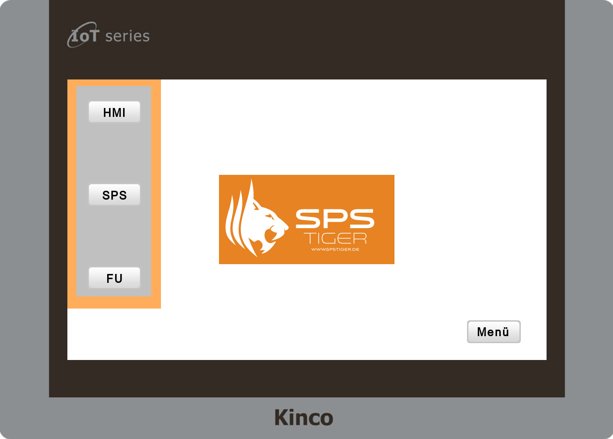

# Kinco HMI Beispielprojekt für eine Navigationsleiste, die in allen Fenstern aufrufbar ist

HMI-Demoprojekt, mit einer Navigationsleiste links, die in allen Bildern aufrufbar ist.

Die Navigationsleiste verschwindet nach dem Auswählen des Fensters.

